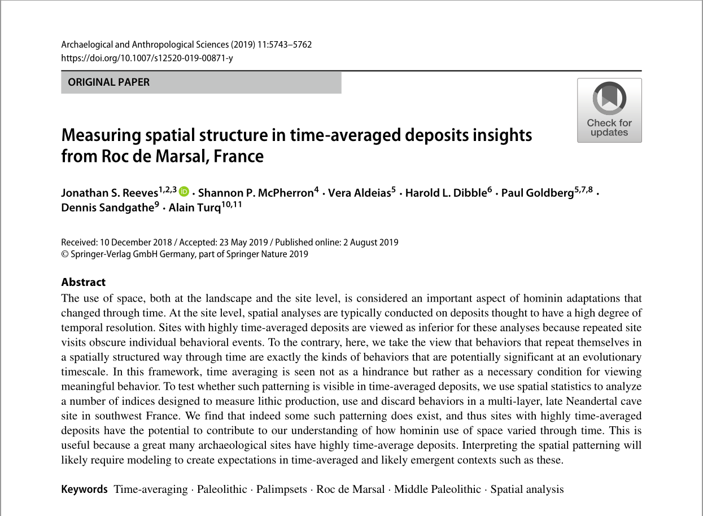
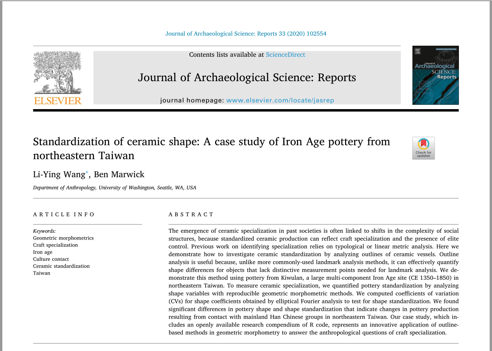

## What is R?

- R is a free software environment for statistical computing and graphics.

## What can you do with R?

- [Regular data visualization](https://www.r-graph-gallery.com/index.html)

- [Cool mapping](https://ggplot2tutor.com/streetmaps/streetmaps/)

- [Even cooler 3D models](https://www.tylermw.com/a-step-by-step-guide-to-making-3d-maps-with-satellite-imagery-in-r/)

## Why should you use R instead of SPSS?

- It's free!

- It's backed by a growing open-source community.

- It's friendly for lazy people like me.

## Case study 1: stone tools ([Reeves et al. 2019](https://link.springer.com/article/10.1007/s12520-019-00871-y))

## Case study 2: pottery ([Wang and Marwick, 2020](https://www.sciencedirect.com/science/article/abs/pii/S2352409X2030345X))

## Case study 3: zooarchaeology ([Orton et al. 2016](https://www.openquaternary.com/articles/10.5334/oq.28/))

## R and reproducible research ([Markowetz, 2015](https://genomebiology.biomedcentral.com/articles/10.1186/s13059-015-0850-7))

- Reproducibility helps to avoid disaster.

- Reproducibility makes it easier to write papers.

- Reproducibility helps reviewers see it your way.

- Reproducibility enables continuity of your work.

- Reproducibility helps to build your reputation.

## Resources available
- [Dr. Ben Marwick's GitHub](https://github.com/benmarwick/ctv-archaeology)

- [Dr. Melinda Higgins's Reproducible Templates for Analysis and Dissemination](https://www.coursera.org/learn/reproducible-templates-analysis)

- [Duke University's Statistics with R](https://www.coursera.org/specializations/statistics)

- [Dr. David Carson's _Quantitative Methods in Archaeology Using R_](https://www.cambridge.org/core/books/quantitative-methods-in-archaeology-using-r/DEAE593FA2418EA3B8ECD538C34ED2D5)

- [Dr. Ben Marwick's (ed.) _How to Do Archaeological Science Using R_](https://benmarwick.github.io/How-To-Do-Archaeological-Science-Using-R/index.html)

